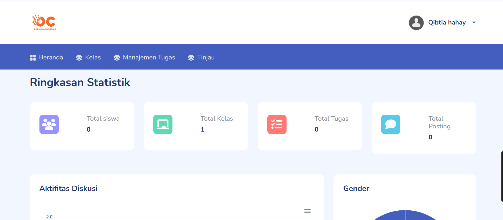
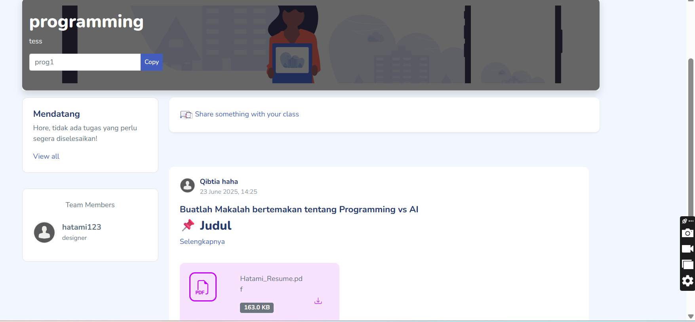
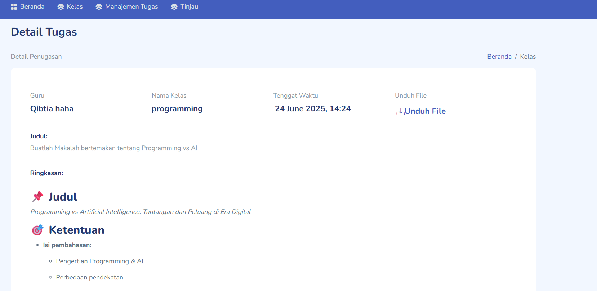
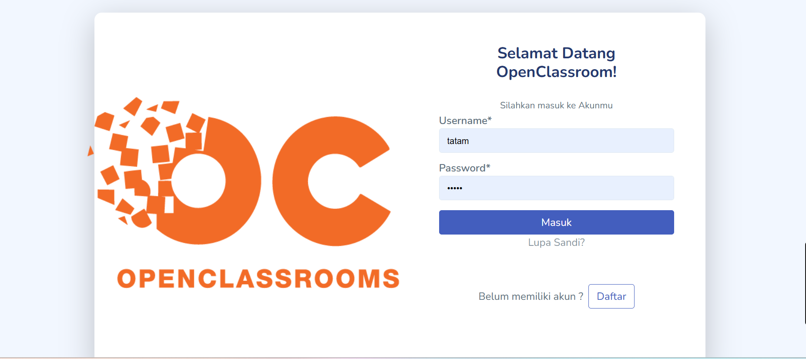
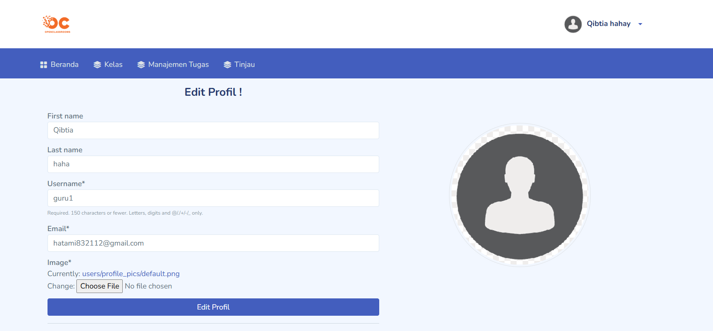
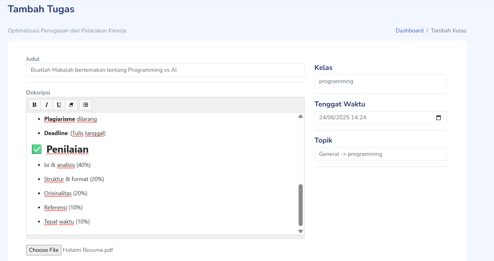

[](https://www.python.org/downloads/release/python-360/)

[]()
# Open Classroom
This is an attempt to clone the best features of google classroom and educative.io using django.

## Screenshots 


 
  
  
 
  


## Features Included 
- Custom Admin dashboard
- Create Classroom
- Join Classroom
- Add Posts 
- Create Assignments 
- Grade Assignments 
- Add Resources 
- WhiteBoard 
- Colaborative Whiteboard
- Courses 
- News Letter 
- Responsive, mobile-friendly design
- Forgot password 
- User registration
- Much more...

## Installation

**1. Clone Repository & Install Packages**
```sh
git clone https://github.com/mohamad1213/CLProject
pip install -r requirements.txt
```
**2. Setup Environment**
```sh
python -m  venv venv
source venv/bin/activate
``````
OR on Windows
```sh
python -m  venv venv
activate.bat
``````

**3. Migrate & Start Server**
```sh
python manage.py makemigrations
python manage.py migrate
python manage.py runserver
```
